# upnext at competitor scale, 2026-09-04

Deploy upnext to `https://upnext.cjjutba.dev`, then drive that origin at the
load a competitor demonstrated: 39 players, 4 courts, a night's worth of games.
Everything below is measured on the deployed production build over HTTPS, with
the production service worker and real IndexedDB. No dev server, no local
build, no source changes.

Headline: the O(n squared) replay everyone worried about is not the problem.
A win tap costs 2.9 ms at 39 players and 224 events, and 5.8 ms at 944 events.
Nothing crossed 100 ms in 520 recorded games. The two things that actually
break at this scale are the voice queue, which ran 18.3 seconds behind reality
when four courts finished together, and the court grid, which collapses to a
single column on a 1024x768 tablet and makes the organizer scroll six screens
to see four courts.

## Contents

1. [The subdomain is live](#1-the-subdomain-is-live)
2. [How this was measured](#2-how-this-was-measured)
3. [Replay against event count](#3-replay-against-event-count)
4. [Interaction latency, 12 players against 39](#4-interaction-latency-12-players-against-39)
5. [Screenshots at 12, 25 and 39 players](#5-screenshots-at-12-25-and-39-players)
6. [Layout at scale](#6-layout-at-scale)
7. [Voice under simultaneous finishes](#7-voice-under-simultaneous-finishes)
8. [Endurance](#8-endurance)
9. [Console errors](#9-console-errors)
10. [Ranked list of what to fix](#10-ranked-list-of-what-to-fix)
11. [What I did not test](#11-what-i-did-not-test)
12. [Follow-up: the two blockers, fixed and re-measured](#12-follow-up-the-two-blockers-fixed-and-re-measured)

## 1. The subdomain is live

`upnext.cjjutba.dev` serves the app over HTTPS from the same production
deployment as before. `upnext-ebon.vercel.app` still works and is still
attached to the project.

`cjjutba.dev` runs on Porkbun nameservers, not Vercel's, so adding the domain
to the project was only half the job. The record was created through the
Porkbun API.

| Step | What was done | Result |
|---|---|---|
| Vercel domain | `vercel domains add upnext.cjjutba.dev upnext` | `domain_added` |
| DNS | Porkbun record 581243928, `upnext` CNAME `cname.vercel-dns.com`, TTL 600 | resolves to 76.76.21.x and 66.33.60.x |
| Vercel config check | `GET /v6/domains/upnext.cjjutba.dev/config` | `misconfigured: false` |
| Certificate | Let's Encrypt, CN `upnext.cjjutba.dev` | valid 2026-09-04 to 2026-12-03, SAN holds only this name |
| Time to issue | first poll after the record propagated | under 10 seconds |

I used a CNAME rather than the A record Vercel's warning suggests, because
Vercel's own config endpoint lists `cname.vercel-dns.com` as the rank 1
recommendation for a subdomain and a CNAME follows Vercel's IP changes without
another DNS edit. The apex `cjjutba.dev` and `www` are untouched.

### HTTPS and routing

| URL | Status |
|---|---|
| `https://upnext.cjjutba.dev/` | 200, landing page |
| `https://upnext.cjjutba.dev/app` | 200 |
| `https://upnext.cjjutba.dev/app/board` | 200, the `/app/:path*` rewrite works on the new origin |
| `https://upnext-ebon.vercel.app/` | 200, unchanged |

### PWA on the new origin

Service worker scope and manifest scope are origin bound, so all of this was
re-checked rather than assumed.

| Check | Result |
|---|---|
| `/manifest.webmanifest` | 200, `application/manifest+json; charset=utf-8`, parses, `start_url` `/app`, `scope` `/app`, 5 icons |
| Service worker registers | yes, scope `https://upnext.cjjutba.dev/`, active, controlling from the second load |
| Precache contents | `workbox-precache-v2-https://upnext.cjjutba.dev/` with 13 entries, plus 2 Google font files |
| Offline reload of `/app/board` | board rendered in 50 ms, all 238 events replayed, 23 waiting, courts intact |
| Offline load of `start_url` `/app` | loads and resolves to the live session |
| Offline load of a deep route with no file behind it | `/app/board` answered by `navigateFallback`, no 404 |
| Offline load of `/` | landing page also comes from precache |
| Installability | Chrome fired `beforeinstallprompt` with `platforms: ["web"]` |
| Installed window | opening `/app` in a Chrome app window reports `display-mode: standalone` and renders the roster, not an error |

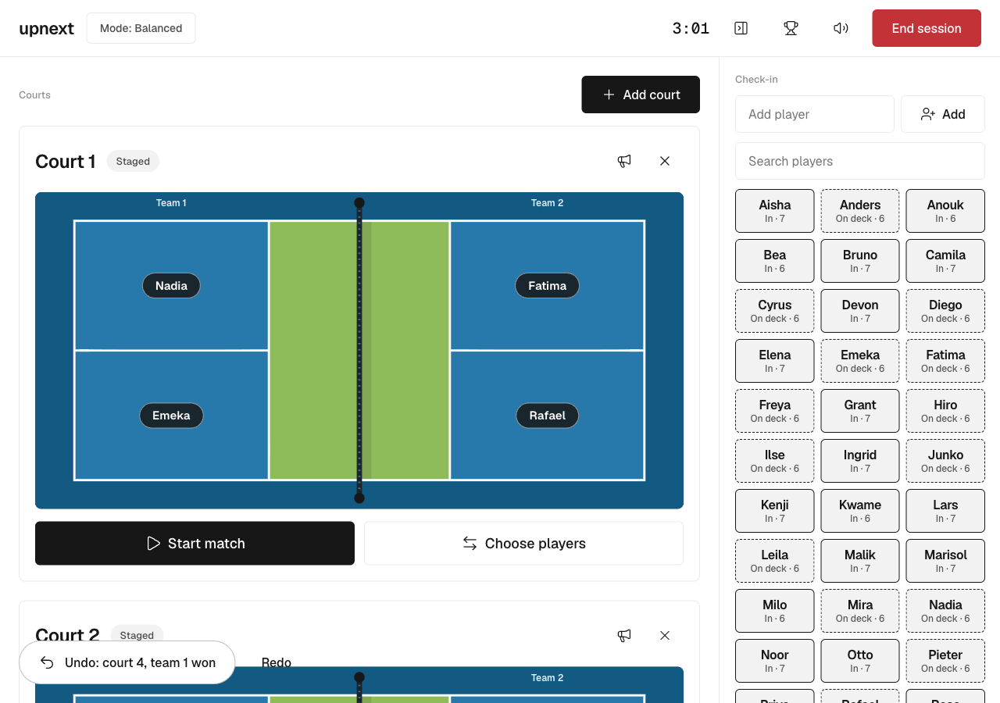

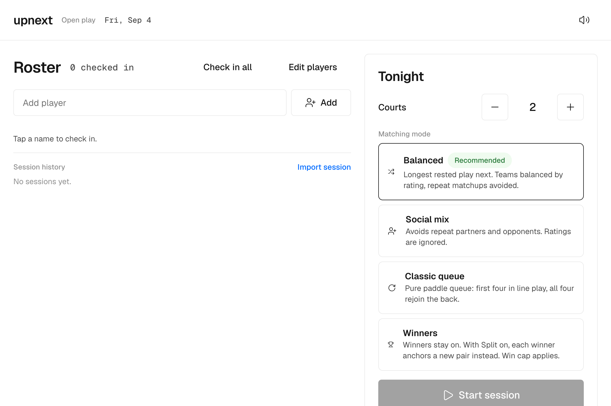

I did not install the PWA from the Chrome menu and launch it from the macOS
dock. What I verified is the two things that would break it: Chrome's
installability criteria are met on the new origin, and the manifest's
`start_url` renders the app from cache with the network off.

## 2. How this was measured

A `puppeteer-core` driver on the real DOM, headful Chrome at 1280x900, against
`https://upnext.cjjutba.dev`. Each run starts from an IndexedDB cleared through
CDP `Storage.clearDataForOrigin`.

All 60 games ran through the UI. I never touched `dispatch` from the console.
The driver types names into the check-in field, presses Enter, taps chips, taps
Start match, types both scores, and taps the button that records the winner,
exactly where a thumb would land.

Two numbers per interaction:

- **dom ms**, from `element.click()` to the DOM commit that satisfies a
  predicate for that action, for example "the record button for court 3 is
  gone". A predicate rather than any mutation, because the court clock ticks
  every second and would otherwise be measured as a response.
- **painted ms**, to the second `requestAnimationFrame` after that commit. This
  is frame quantised, so treat 8 to 16 ms as "one frame" rather than as signal.

Replay is measured by bundling the deployed commit's own `src/domain` with
esbuild, injecting it into the live page, reading the log straight out of
IndexedDB, and running the real `replay()` over it. Median of 9 runs. Nothing
in `src/` was changed to do this. Chrome clamps `performance.now()` to 100
microseconds on a page that is not cross-origin isolated, which is why the
in-page replay figures land on 0.1 ms steps.

Four sessions were driven:

| Tag | Players | Courts | Games | Events | CPU |
|---|---|---|---|---|---|
| p12 | 12 | 2 | 10 | 45 | full |
| p39 | 39 | 4 | 60 | 224 | full |
| p39-long | 39 | 4 | 300 | 944 | full |
| p39-slow | 39 | 4 | 150 | 496 | 6x throttle |

The 6x throttled run stands in for a mid range Android tablet rather than the
laptop this was driven from. Announcements were muted for the two long runs, so
a speech backlog could not distort the interaction timings. Voice was measured
separately in section 7.

The driver, the injected measurement bundle and every raw result JSON are in
`.context/run/` in this workspace. `.context/` is gitignored, so they do not
travel with the branch.

### Three things to know before reading the numbers

**The deployed build is ahead of this branch.** Production is commit `a343627`;
this workspace sits at `ff37695`, two commits back. In `a343627` the two
"Team 1 wins" and "Team 2 wins" buttons became one button whose label follows
the scores, so the tap the brief calls "Team 1 Wins" is now the single record
button, reached by typing 11 and 7 and tapping the verdict. All timings are for
that control.

**The steady state queue is 23, not 27.** With 39 checked in and 4 courts, the
board holds 16 players on courts and shows "23 waiting". 27 waiting implies 3
courts live, not 4. I measured what the app actually does at 39 and 4.

**Games were played far faster than a real night.** The whole 60 game session,
including typing 39 names, took 26 seconds of wall clock. A real one takes three
hours. That compression is harmless for latency and replay, which depend on log
length and not on pace. It is not harmless for voice, so section 7 uses a
controlled burst at a human tapping speed instead.

## 3. Replay against event count

Real logs, read from IndexedDB on the deployed page, replayed by the deployed
commit's own reducer.

| Events | Games | Log as JSON | Replay, full CPU | Replay plus standings, previews and the undo scan, full CPU | Replay, 6x throttle |
|---|---|---|---|---|---|
| 100 | 18 | 30 KB | 0.2 ms | 0.4 ms | 0.9 ms |
| 302 | 85 | 97 KB | 0.5 ms | 0.8 ms | 2.8 ms |
| 496 | 150 | 161 KB | not measured | not measured | 4.6 ms |
| 602 | 185 | 196 KB | 1.0 ms | 1.8 ms | not reached |
| 944 | 300 | 310 KB | 1.0 ms | 1.8 ms | not reached |

The fifth column matters more than the fourth. Every append re-runs `replay()`,
and `App` then recomputes `standings(state)` and `previewLineups(state)` and
scans the log twice for `undoTarget` and `redoTarget`. That whole bundle costs
1.8 ms at 944 events on this laptop, and 8.0 ms at 496 events on the 6x
throttled one.

Because the 100 microsecond clamp is coarse at the low end, the same bundle run
under Node gives finer resolution on the same code and the same event shapes:
0.124 ms at 100 events, 0.313 ms at 300, 0.829 ms at 600, 1.553 ms at 1000.
Cumulative replay across all 639 appends needed to reach 1000 events was
507 ms, which is the entire quadratic cost of a session five times longer than a
real one.

**A 60 game night produces 224 events.** Three events per game, plus one
`session-started`, 39 `player-checked-in` and 4 opening `game-staged`. The
1000 event mark the brief asks about is about 320 games, five nights of play in
one unbroken log.

## 4. Interaction latency, 12 players against 39

| Interaction | 12 players, 2 courts | 39 players, 4 courts |
|---|---|---|
| Record the winner, dom median | 2.70 ms | 2.85 ms |
| Record the winner, dom max | 2.90 ms | 4.50 ms |
| Record the winner, painted median | 6.70 ms | 8.05 ms |
| Start match, dom median | 1.75 ms | 1.90 ms |
| Tap a check-in tile, dom median | under 0.1 ms | 0.30 ms |
| Add a name, Enter to chip on screen, median | 7 ms | 7 ms |
| Add a name, Enter to chip on screen, max | 10 ms | 17 ms |
| Start session, tap to board | 23 ms | 33 ms |
| Cold load to roster | 818 ms | 720 ms |

Tripling the roster and doubling the courts costs 0.15 ms on the tap that
matters. That is the honest answer to "does it degrade at 39", and it is no.

### Where it does grow

Latency tracks log length, not player count. From the 300 game run:

| Log length | Record the winner, dom median | dom max | painted median |
|---|---|---|---|
| under 100 events | 3.10 ms | 4.30 ms | 14.0 ms |
| 100 to 199 | 3.70 ms | 5.30 ms | 15.7 ms |
| 200 to 299 | 4.20 ms | 5.70 ms | 16.2 ms |
| 300 to 399 | 4.40 ms | 6.10 ms | 16.0 ms |
| 400 to 499 | 4.40 ms | 5.90 ms | 15.4 ms |
| 500 to 599 | 5.10 ms | 6.90 ms | 16.6 ms |
| 600 to 699 | 4.80 ms | 6.10 ms | 16.3 ms |
| 700 to 799 | 5.60 ms | 7.10 ms | 16.1 ms |
| 800 to 899 | 5.80 ms | 7.10 ms | 15.8 ms |

And on a 6x throttled CPU:

| Log length | Record the winner, dom median | painted median |
|---|---|---|
| under 100 events | 15.4 ms | 27.9 ms |
| 100 to 199 | 15.4 ms | 28.1 ms |
| 200 to 299 | 17.0 ms | 29.5 ms |
| 300 to 399 | 18.0 ms | 30.6 ms |
| 400 to 499 | 20.5 ms | 34.2 ms |

**No interaction crossed 100 ms.** Not one, in 520 recorded games across the
four sessions, throttled or not.

Fitting the growth gives the number nobody had:

| Device | Cost per event of log | 100 ms crossing |
|---|---|---|
| This laptop | 2.3 microseconds | about 42,000 events, roughly 13,000 games |
| 6x throttled, dom | 12.8 microseconds | about 6,700 events, roughly 2,100 games |
| 6x throttled, painted | 15.2 microseconds | about 4,900 events, roughly 1,500 games |

So on a slow tablet the quadratic replay would start to be felt after roughly
1,500 games in one unbroken log, which is 25 nights of open play without ever
ending a session. Every session ends, and ending one starts a new log. The
O(n squared) replay is real, it is measurable, and it will not be what hurts
first. I would not spend a sprint on it.

## 5. Screenshots at 12, 25 and 39 players

Roster on a 1280x900 tablet, taken during the check-in flow at each count:

| 12 players | 25 players | 39 players |
|---|---|---|
| 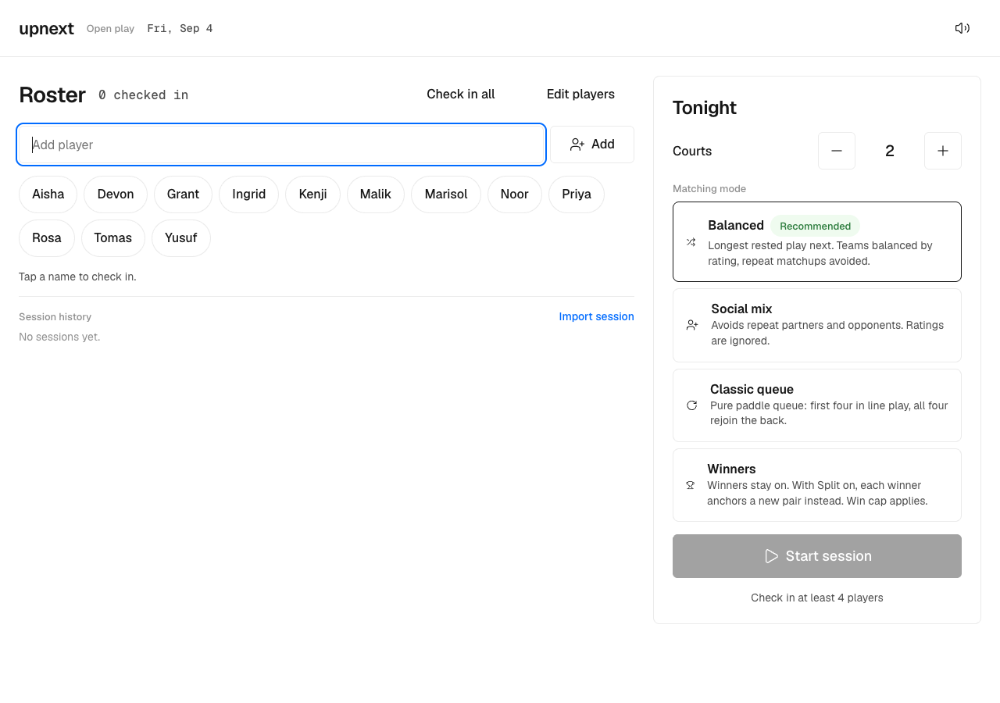 | 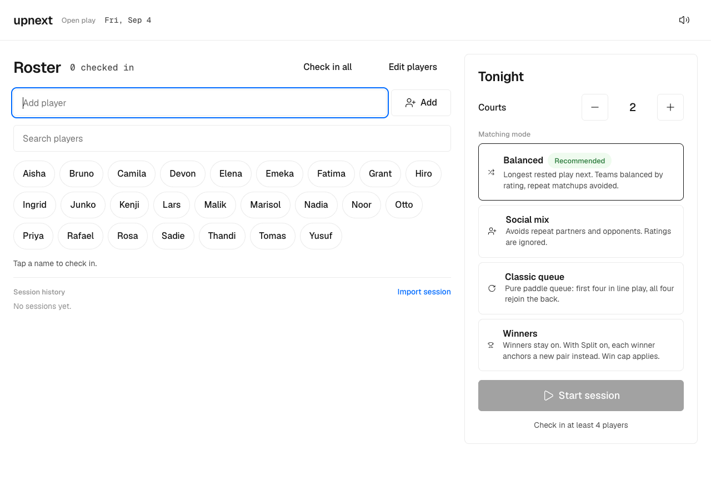 | 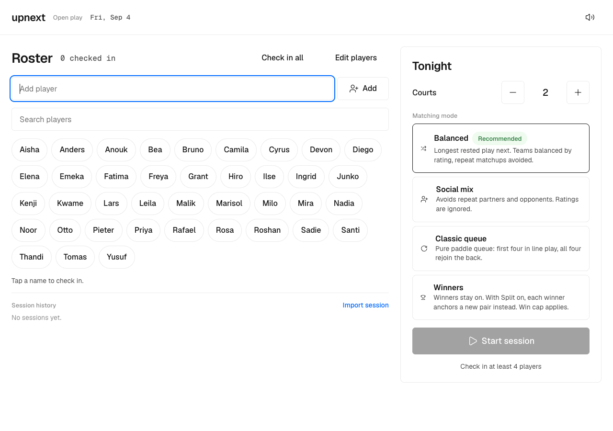 |

The roster screen holds up. 39 chips wrap into five rows and the whole screen
still fits above the fold at 900 px tall. The search field appears past 12
players, as designed.

Same three counts at phone portrait, 390x844:

| 12 players | 25 players | 39 players |
|---|---|---|
| 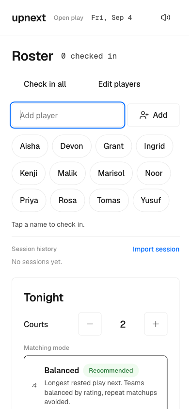 | 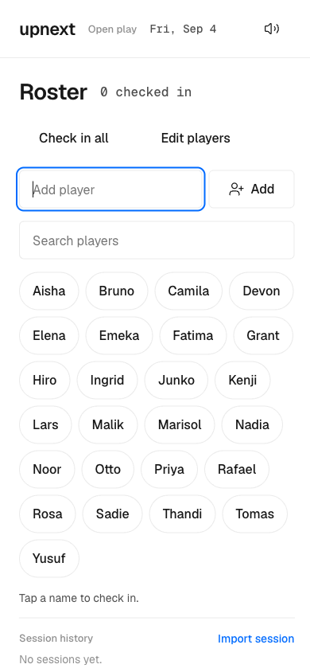 | 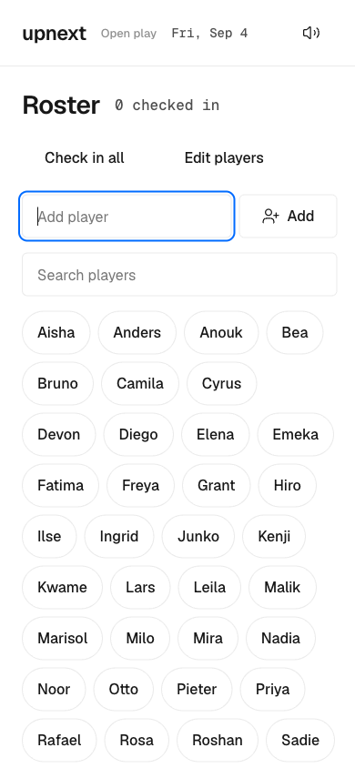 |

Page height grows from 1338 px at 12 players to 1794 px at 39, and Start
session moves from y=1199 to y=1655. Two screens of scroll to reach the button
that begins the night. Annoying, not broken.

Check-in at this scale is 39 names typed, then 39 chip taps, because adding a
player does not check them in. Check in all does it in one tap, but only when
every name on the roster is present tonight. The app side of it is free: median
7 ms from Enter to the chip appearing, worst case 17 ms at full speed and 21 ms
on a 6x throttled CPU. Typing is the whole cost.

## 6. Layout at scale

This is where the app is worst at 39 players and 4 courts. Measured with the
courts column scrolled to the top, then again with the check-in rail hidden.

| Viewport | Rail | Court columns | Court card | Screens of scroll in the courts area |
|---|---|---|---|---|
| 1440x900 | open | 2 | 504x404 | 2.59 |
| 1440x900 | hidden | 2 | 684x492 | 3.02 |
| 1280x900 | open | **1** | 872x583 | **6.21** |
| 1280x900 | hidden | 2 | 604x452 | 2.83 |
| 1024x768 | open | **1** | 616x458 | **5.95** |
| 1024x768 | hidden | **1** | 976x634 | **7.97** |
| 834x1112 iPad portrait | either | 1 | 802x549 | page scroll, 5935 px document |
| 390x844 phone | either | 1 | 358x332 | page scroll, 4256 px document |
| 360x800 phone | either | 1 | 328x318 | page scroll, 4221 px document |

### The 1024x768 tablet shows one court at a time

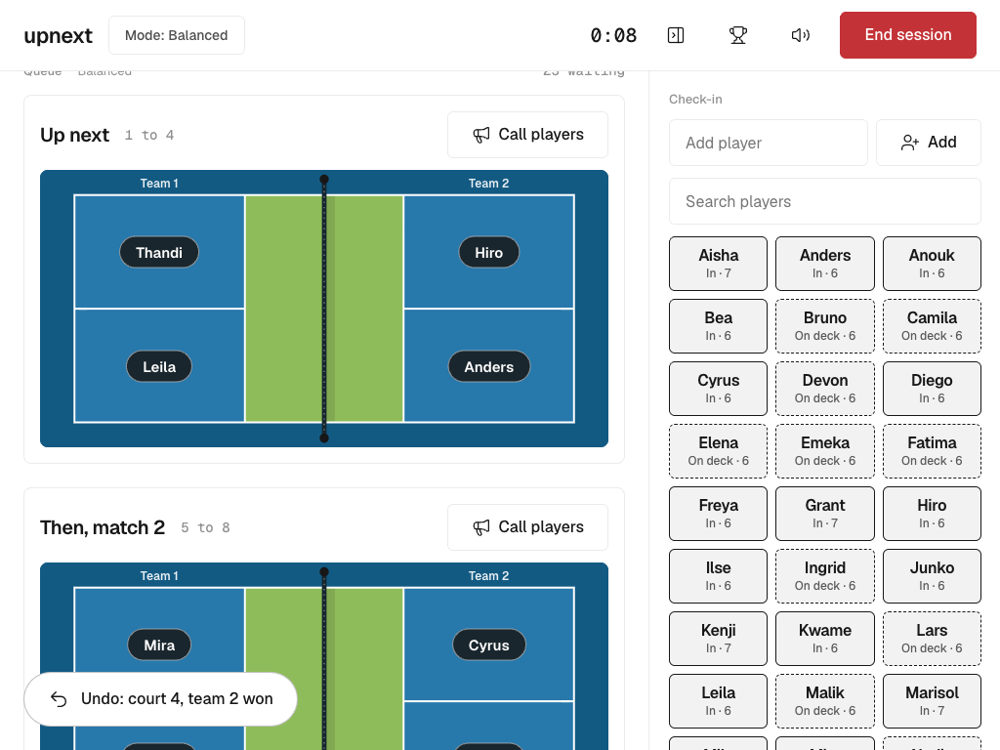

At the tablet viewport the brief names, a 4-court board is a single column of
616x458 cards inside a 695 px tall scroller. Six screens of scrolling to see
four courts and four queue panels. The organizer cannot see two courts at once,
which is the one thing a courtside board is for.

The cause is one arithmetic threshold. The grid is
`repeat(auto-fit, minmax(min(100%, 480px), 1fr))` with a 24 px gap, so two
columns need 984 px of content width. Subtract the 48 px of padding and the
360 px rail: 1024 leaves 616 and 1280 leaves 872. Neither reaches 984, so both
fall to one column. 1440 leaves 1032 and gets two.

### Hiding the rail makes 1024x768 worse

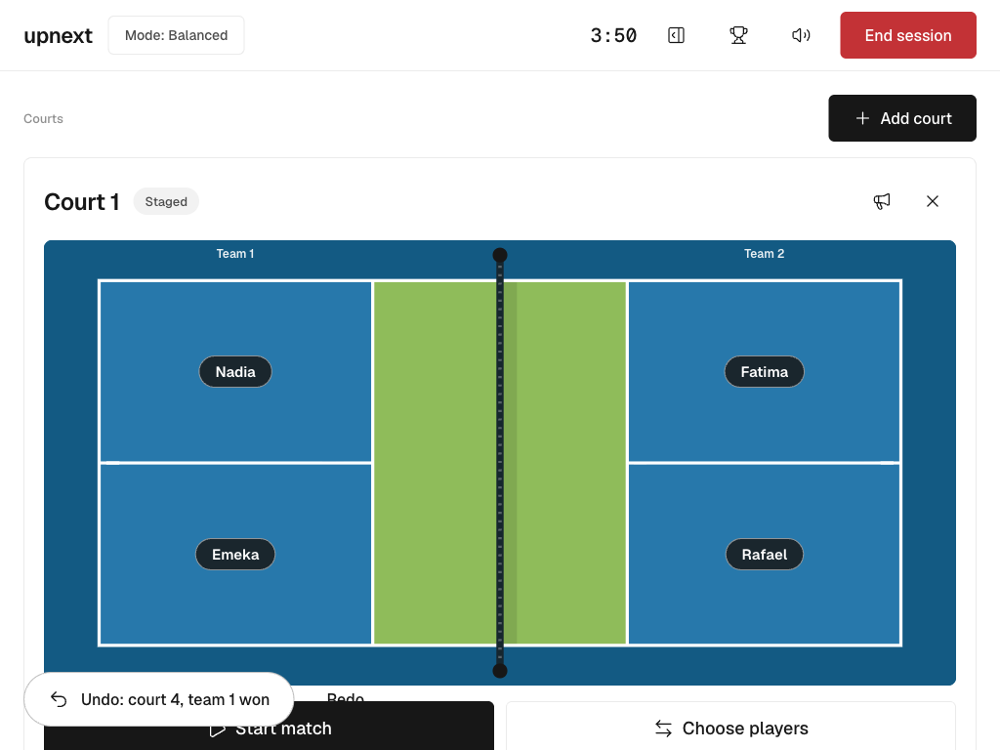

Hiding the rail at 1024 frees 360 px, reaching 976 px of content. Two columns
need 984: two 480 px minimums and the 24 px gap. Eight pixels short. So the
grid stays at one track, the single track takes the whole 976, and the card
grows from 616x458 to 976x634. The scroll goes from 5.95 screens to 7.97.
Giving the board more room made it show less.

Correction, added with the follow-up: I first put this down to commit
`239569e` switching `auto-fill` to `auto-fit`. That is wrong. At one track the
two behave identically, so `auto-fill` would have produced the same 976x634
card. The 480 px minimum is the whole cause. `auto-fit` does cause a related
problem, which section 12 measures: it collapses tracks that hold no card, so
one court on a wide board stretched to the full column. At 1280 hiding the rail
is a real win either way, one column to two.

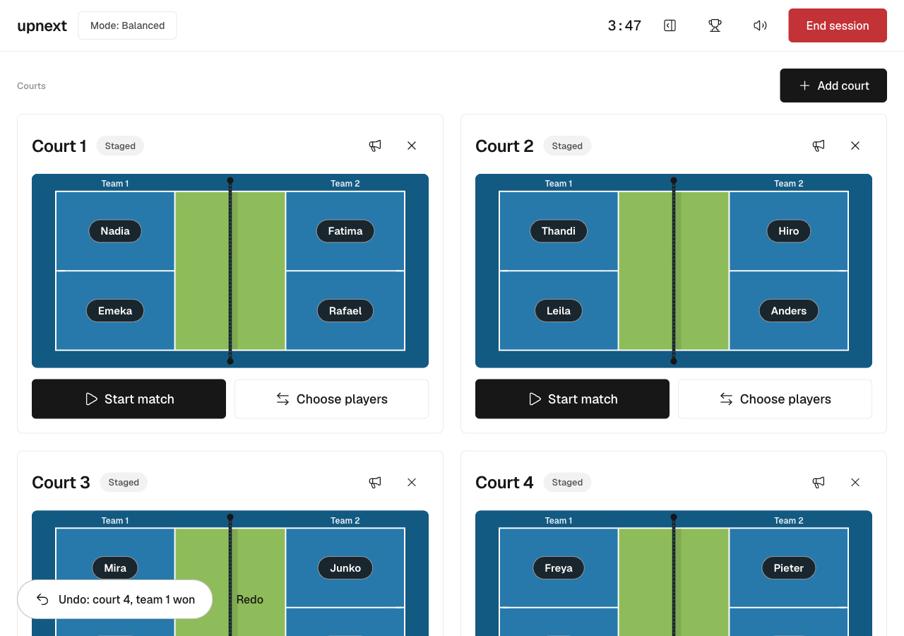

### The check-in rail is fine

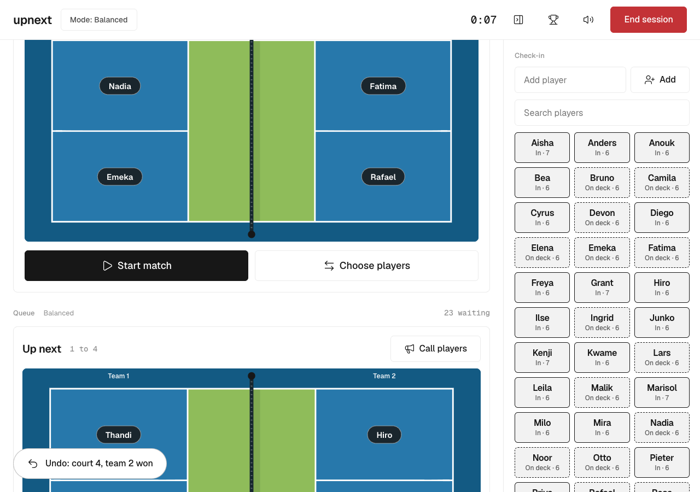

39 tiles in a 3-wide grid inside a 360 px rail is 1013 px of content. That is
1.22 screens at 1280x900 and 1.46 at 1024x768. The search field is there, tile
state and games played are legible, nothing overlaps. One scroll to reach the
bottom of the roster is a fair price. This one is not a problem.

### The queue panel is readable, and there is a lot of it

With 23 waiting the board draws 4 queue panels, one per open court, each a full
court diagram, then 7 "Also waiting" rows underneath. Readable, and it is why
the courts area is six screens tall: four court cards and four queue diagrams
of nearly the same size. On a board where only one court fits on screen, four
full-size drawings of games that have not started yet are competing with the
games that have.

### Court chips are under the app's own tap minimum

`--tap-min` in `src/styles/tokens.css` is 48 px. At 1280x900 with 39 players,
54 controls on the board are under it:

| Control | Height | Count on screen |
|---|---|---|
| Name chip on a court diagram or queue panel | 33 px | 32 |
| Name button in an "Also waiting" row | 24 px | 7 |
| Sit out and Remove icons on those rows | 36 px | 14 |
| Change matching mode | 40 px | 1 |

The chips are the ones that matter. They open the substitute picker, and
hitting the right 33 px target on a phone with a wet hand is not going to go
well.

### Phone portrait

4256 px of document, no horizontal overflow, cards at 358x332, the rail stacked
underneath as designed. It works. It is a long page, and there is no way to
jump from court 1 to the check-in list without scrolling past three courts and
four queue panels, but nothing is broken.

## 7. Voice under simultaneous finishes

This is the headline feature and it is the thing that fails at 4 courts.

Four courts finished within 368 ms of each other, which is one organizer
walking the row and tapping four record buttons. Announcements were queued
immediately. Here is when they were actually spoken.

| Court | Tap at | Queued at | Speech started | Speech ended | Behind reality |
|---|---|---|---|---|---|
| 1 | 5790 ms | 5798 ms | 17552 ms | 19834 ms | **11.75 s** |
| 2 | 5912 ms | 5917 ms | 19838 ms | 22149 ms | **13.92 s** |
| 3 | 6034 ms | 6040 ms | 22152 ms | 24463 ms | **16.11 s** |
| 4 | 6158 ms | 6168 ms | 24466 ms | 26746 ms | **18.30 s** |

Nothing was dropped, nothing overlapped, and order was preserved. The queue is
strictly FIFO and it never gives up on an announcement, which is exactly the
problem.

The arithmetic that produces it:

- "Court 1. Rosa and Ingrid win." is 2.28 seconds of speech. All four finish
  lines measured 2.28 to 2.31 s.
- "Court 1. Rosa and Ingrid versus Devon and Yusuf. Please proceed to court 1."
  is about 5.1 s. Three of those had been queued five seconds before the burst,
  from starting the matches, and they had to finish first.
- So a round of 4 courts finishing and refilling is roughly 30 seconds of
  continuous speech: four 2.3 s results plus four 5.1 s court calls.

By the time court 4's result was announced, all four courts had already
restaged on screen and, in a gym, the next sixteen people would be walking on.
The voice is describing a board state that no longer exists, and it will keep
doing so for the rest of the night because nothing ever clears the backlog.

Driving 60 games at machine speed makes the shape of it obvious, even though
the pace is not realistic. 121 utterances were queued and 3 had been spoken by
the time the session ended 26 seconds later. The queue grows without bound
because nothing ever decides an announcement is too old to be worth saying. At
a real pace the backlog drains between rounds, so the worst case is the one
measured above, roughly 30 seconds after a simultaneous finish.

`speak()` in `src/lib/speech.ts` calls `s.resume()` when the queue is paused,
which handles Chrome's stall, and that worked: every utterance in the
controlled burst started and ended cleanly. The missing piece is not
reliability, it is that a court call has a shelf life and this queue does not
know that.

## 8. Endurance

**Wake lock holds and re-acquires.** On the board, `navigator.wakeLock.request`
succeeded. Backgrounding the tab released the sentinel at the same millisecond
`visibilitychange` fired, and bringing the tab back requested a new one 3.1 s
later, which succeeded. Three log entries: request, released, request. The
`visibilitychange` handler in `src/lib/useWakeLock.ts` does what it says.

**Undo is correct deep in the log.** At 236 events and 63 finished games, the
pill read "Undo: court 4, team 1 won". One tap: finished games 63 to 62, live
courts 0 to 1, staged 4 to 3, queue unchanged at 23, roster unchanged at 39.
That is exactly right. Undoing a finish puts the game back on the court and
takes back the auto-stage in the same batch. Redo restored all of it, and the
pill went back to the same label. The same check at 944 events behaved the
same way. Nothing was deleted; both operations appended an `event-undone`.

**Reload replays cleanly.** 583 ms from reload to a rendered board at 238
events, and 50 ms offline from precache. State came back identical: 4 staged
courts, 23 waiting.

**Storage.** `navigator.storage.persist()` reported `false` on the first two
sessions and `true` on the later ones, so persistence arrived once Chrome had
seen the origin used repeatedly rather than on request.

| Events | Games | Log as JSON | IndexedDB reported |
|---|---|---|---|
| 45 | 10 | 14 KB | 141 KB |
| 224 | 60 | 71 KB | 654 KB |
| 496 | 150 | 161 KB | 1.38 MB |
| 944 | 300 | 310 KB | 2.58 MB |

**A real night costs 224 events, 71 KB of JSON and 654 KB of IndexedDB.**
Dexie's per-row and index overhead is about 8x the JSON, mostly from the four
indexes on `sessionEvents` beside its primary key. Against a 10 GB quota that
does not matter. It would matter for an export over a phone tether, except
export sends the JSON, not the store.

## 9. Console errors

**None.** Zero errors, zero warnings, zero unhandled rejections, zero failed
requests, across all four sessions, 520 games, about 1,700 appended events,
offline reloads, deep route loads, undo, redo, and a standalone app window. The
`window.onerror` and `unhandledrejection` listeners were installed before any
page script ran, and `console` was captured through CDP for the whole run.

There is nothing to reproduce, which is the good outcome and also the reason
the next point is worth making. `src/App.tsx` has no error boundary and
`src/main.tsx` installs no global handler, so the day something does throw
during render, the organizer gets a white screen mid-session with no message,
no retry and no hint that the log is still safe in IndexedDB. The log would
survive. The night would not.

## 10. Ranked list of what to fix

### Launch blockers

**1. The voice queue goes 18 seconds behind and never catches up.**
Four courts finishing together is normal at open play, and it puts the last
announcement 18.3 s after the tap, describing a board that has already moved
on. Section 7 has the numbers. This is the feature the landing page leads with
("It calls the courts out loud, so you can put the tablet down"), and at 4
courts it tells people the wrong thing. Fix by giving announcements a shelf
life: cancel a court's pending call when that court's state changes again,
collapse a burst of finishes into one line, or cap the queue and drop the
oldest. Any of the three ends the drift.

**2. The 4-court board is one column at 1024x768 and 1280x900.**
Six screens of scrolling to see four courts on a 1024x768 tablet, and hiding
the rail there makes it eight. Section 6 has the numbers. The
480 px card minimum plus the 360 px rail is what does it. A denser card at
narrow widths, a lower minimum, or a rail that overlays rather than takes width
would all fix it. Right now the organizer cannot see the board.

### Worth fixing before it embarrasses you

**3. Queue panels are as large as live courts.**
Four full court diagrams for games that have not started, stacked under four
court cards, is most of the six screens. A waiting four does not need the same
drawing as a live game.

**4. Fifty-four controls on the board are under the app's own 48 px tap token.**
The 33 px name chips are the worst of them, 32 on screen at once.

**5. No error boundary and no global error handler.**
Nothing threw in 520 games, so this is insurance rather than a bug. It is also
about twenty lines, and the failure it prevents is a white screen at 7pm on a
Tuesday with 39 people waiting.

**6. Check-in at 39 is 78 interactions.**
39 names typed, then 39 chips tapped, because adding a player does not check
them in. Check in all helps only when the roster is exactly tonight's
attendance. Auto-checking a player you just added during setup would halve it.

### Do not bother yet

**7. The O(n squared) replay.**
Real, measured, and 1,500 games away from mattering on a slow tablet.
Section 4 has the fits. Revisit if sessions ever stop being per night.

**8. `useRoster.addPlayer` reads the whole players table twice per add.**
Once for the duplicate check, once for the refresh. 21 ms at 39 players on a
6x throttled CPU. It is O(n) per add and the n is a club roster.

**9. IndexedDB is about 8x the JSON.**
2.58 MB at 944 events. Fine against a 10 GB quota.

## 11. What I did not test

- Installing the PWA from the Chrome menu and launching it from the dock. I
  verified installability and that `start_url` loads offline instead.
- iOS Safari. Web Speech, wake lock and install behave differently there and
  none of this transfers.
- Real audio output. Utterance start and end events were recorded, not sound.
- More than 4 courts, mid-session mode changes, sit-outs, departures,
  substitutions or lineup edits. The 520 games were start, score, record.
- Multi-tab. Two tabs on one origin share the log and nothing guards that.
- The winners templates. Balanced only, as specified.

## 12. Follow-up: the two blockers, fixed and re-measured

Written 2026-09-04, after sections 1 to 11. Both launch blockers are fixed and
deployed to `https://upnext.cjjutba.dev`. Same harness, same protocol, so the
before column is the measurement from the sections above and the after column
is a fresh run against the deployed fix.

Headline: four courts now fit on a 1280x900 board instead of one, and the worst
announcement in a four-court finish lands 3.4 seconds after the tap instead of
18.3. Both numbers came out of the same harness that found the problems.

Two things did not go to plan and both are written up below. A card `max-width`
turns out to break `auto-fill`, and the two-column board put a court's score
field under the fixed undo pill, which is a new defect the fix created.

### 12.1 What changed in the code

| File | Change |
|---|---|
| `src/screens/SessionBoard.tsx` | One shared `BOARD_GRID`: `auto-fill`, minimum 420 rather than 480. The courts grid and the queue grid had drifted apart and now share it |
| `src/domain/announce.ts` | Shorter phrasing, and every line now carries a `key` naming the court it is about |
| `src/lib/speech.ts` | Holds its own queue, one utterance with the browser at a time, supersedes by key, drops anything past a 5 second shelf life |
| `src/lib/useSpeech.ts` | Signature widened to pass options through. No behaviour change |
| `src/routes/BoardRoute.tsx` | Prop type widened, and the manual Call players button keys its call by court |
| `src/state/useAnnouncer.ts` | Passes each line's key to `speak` |
| Tests | `speech.test.ts` is new, 12 cases. `announce.test.ts`, `useAnnouncer.test.tsx` and `App.test.tsx` updated |

`src/App.tsx`, `src/main.tsx` and `vite.config.ts` are untouched. The court grid
rule was never in `App.tsx`; it lives in `src/screens/SessionBoard.tsx`, so
there is nothing to collide with on the routing branch.

Two files were edited that the brief did not list. `src/lib/useSpeech.ts` and
`src/routes/BoardRoute.tsx` both had `speak: (text: string) => void` in a type,
and a key cannot reach `speech.ts` without widening them. Both changes are one
line, neither is owned by the routing workspace, and `App.tsx` needs no change
because a function with an extra optional parameter is still assignable to the
narrower type. `src/App.test.tsx` also had to change: its speech stub never
fired an `end` event, which the old fire-and-forget `speak` did not care about
and the new queue does.

### 12.2 The court grid

`repeat(auto-fill, minmax(min(100%, 420px), 1fr))`, up from a 480px minimum,
and `auto-fill` in place of `auto-fit`. Two columns now need 864px of content
rather than 984.

| Viewport | Rail | Columns before | Card before | Scroll before | Columns after | Card after | Scroll after |
|---|---|---|---|---|---|---|---|
| 1440x900 | open | 2 | 504x404 | 2.59 | 2 | 504x404 | 2.59 |
| 1440x900 | hidden | 2 | 684x492 | 3.02 | **3** | 448x376 | **2.46** |
| 1280x900 | open | **1** | 872x583 | **6.21** | **2** | 424x365 | **2.41** |
| 1280x900 | hidden | 2 | 604x452 | 2.83 | 2 | 604x452 | 2.83 |
| 1024x768 | open | 1 | 616x458 | 5.95 | 1 | 616x458 | 5.95 |
| 1024x768 | hidden | **1** | 976x634 | **7.97** | **2** | 476x390 | **3.01** |
| 834x1112 | either | 1 | 802x549 | page, 5935px | 1 | 802x549 | page, 5935px |
| 390x844 | either | 1 | 358x332 | page, 4256px | 1 | 358x332 | page, 4256px |
| 360x800 | either | 1 | 328x318 | page, 4221px | 1 | 328x318 | page, 4221px |

The two cases that were supposed to change did:

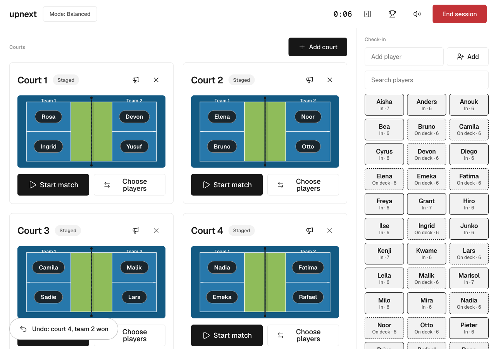

All four courts on one screen at 1280x900 with check-in still open. Before this
the organizer saw one court and scrolled six screens.

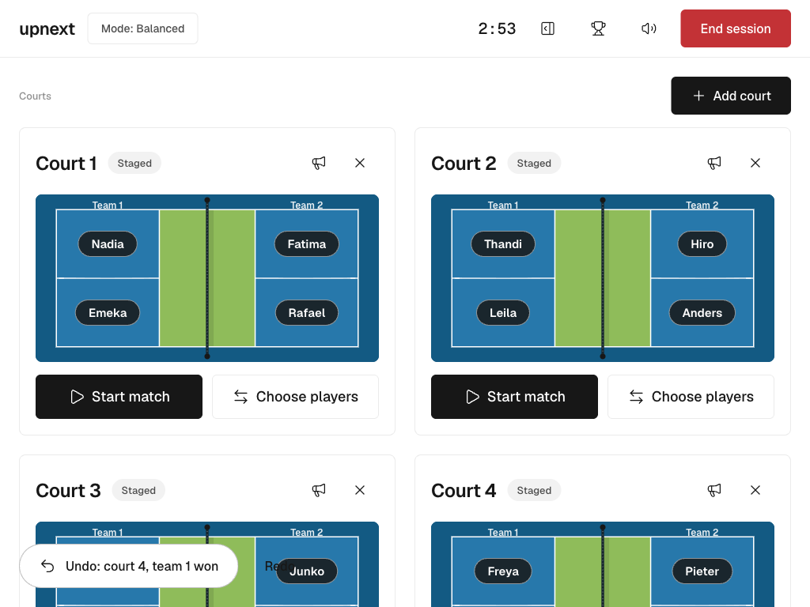

Hiding the rail at 1024 now buys two columns instead of costing two screens of
scroll.

1024 with the rail open is still one column, as the brief predicted. 616px of
content cannot hold two 420px cards. It needs the rail to overlay rather than
take width, which is a bigger change.

### 12.3 The court diagram is legible at 424px

Verified before deploying, on the built bundle. Names, the kitchen line, the
centre line, the team captions and the score row all read at 424px. See the
1280x900 screenshot above. The only thing that suffers is the secondary button
label: "Choose players" wraps to two lines. It stays legible and it is not the
primary action on that card, so I left it.

### 12.4 A card max-width breaks auto-fill, so there is none

The brief asked for `auto-fill` plus a card `max-width`. I shipped the
`auto-fill` and dropped the `max-width`, because measuring it showed it does
the opposite of what it looks like it does.

`auto-fill` counts how many track repetitions fit using the max track sizing
function whenever that max is definite. `1fr` is not definite, so the count
comes from the 420px minimum. A definite `560px` max is, so the count comes
from 560 instead, and the board loses a column. Isolated in a blank page, four
items in a grid of the given width:

| Template | 872px | 976px | 1032px |
|---|---|---|---|
| `auto-fit, minmax(min(100%, 480px), 1fr)`, what shipped before | 1 col, card 872 | 1 col, card 976 | 2 cols, card 504 |
| `auto-fill, minmax(min(100%, 420px), 1fr)`, what ships now | 2 cols, card 424 | 2 cols, card 476 | 2 cols, card 504 |
| `auto-fill, minmax(min(100%, 420px), 560px)`, the capped version | **1 col**, card 560 | **1 col**, card 560 | **1 col**, card 560 |

I ran the capped version through the real board first and got one column at
1280 and 1440 before working out why.

The cap is not needed anyway, because `auto-fill` alone already fixes the
stranded-card case the cap was meant to cover. Same isolated grid, varying how
many cards are in it, measuring the first card:

| Template | Container | 1 card | 2 cards | 3 cards | 4 cards |
|---|---|---|---|---|---|
| `auto-fit` 480/1fr | 1032px | **1032** | 504 | 504 | 504 |
| `auto-fit` 480/1fr | 1392px | **1392** | 684 | 684 | 684 |
| `auto-fill` 420/1fr | 1032px | 504 | 504 | 504 | 504 |
| `auto-fill` 420/1fr | 1392px | 448 | 448 | 448 | 448 |

Under `auto-fill` the card is the same width whatever the court count. That is
the whole of what a `max-width` was for.

On the real board:

| Case | Viewport | Rail | Columns | Card widths | Stretched to full width |
|---|---|---|---|---|---|
| 4 courts | 1280x900 | open | 2 | 424, 424, 424, 424 | no |
| 4 courts | 1440x900 | open | 2 | 504 x4 | no |
| 3 courts, second row holds one | 1280x900 | open | 2 | 424, 424, 424 | no |
| 1 court | 1280x900 | open | 1 of 2 tracks | 424 | no |
| 1 court | 1440x900 | hidden | 1 of 3 tracks | 448 | no |

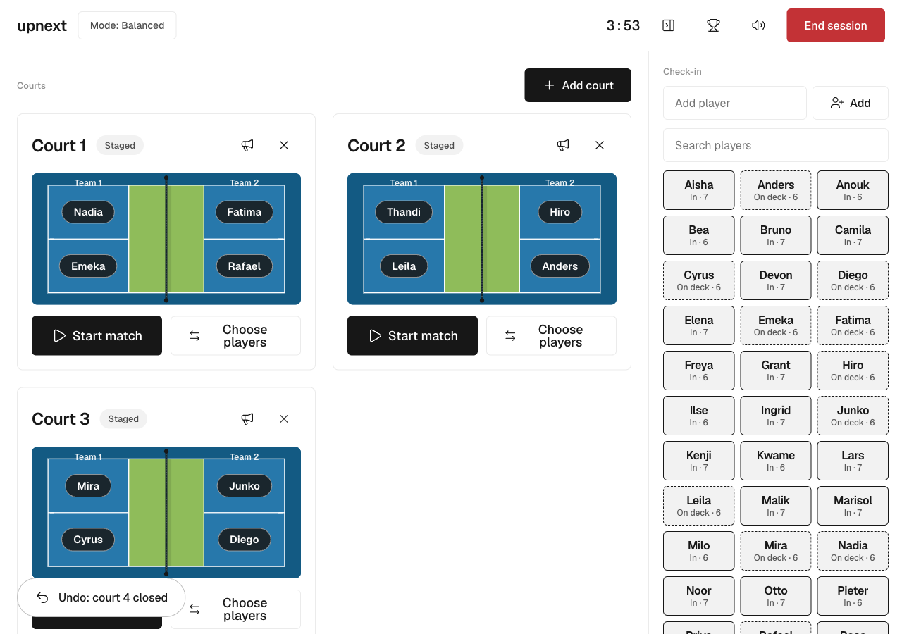

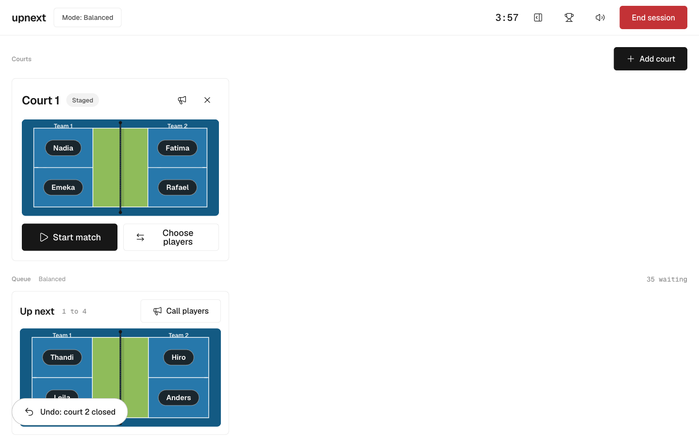

The one court case is the trade `239569e` was trying to avoid. The card is
448px on a 1392px column, so there is a lot of empty space to its right. It
reads as a board with one court open, which it is. A 1392px court card, which
is what `auto-fit` gave, reads as a bug. Your call if the empty space bothers
you; a centred single column would be a two line change.

### 12.5 New defect the grid fix created: the undo pill covers court 3

This one the harness found by clicking where a thumb would.

At 1280x900 with two columns, court 3's card sits at y 550 to 914, so its
primary control lands at x 45 to 230, y 837 to 893. The undo pill is
`position: fixed` at the bottom left, x 24 to 284, y 820 to 876. They overlap,
at the default scroll position, on the first screen the organizer sees.

Measured rather than inferred. `document.elementFromPoint` at the centre of
each court's primary control returns:

| Court | Aiming at | What is actually on top |
|---|---|---|
| 1 | Start match on court 1 | Start match on court 1 |
| 2 | Start match on court 2 | Start match on court 2 |
| 3 | Start match on court 3 | **the undo pill** |
| 4 | Start match on court 4 | Start match on court 4 |

Reproduction: 39 players, 4 courts, at 1280x900, finish any game so the undo
pill appears, scroll the courts area to the top, then aim for court 3's Start
match button or its team 1 score field. You hit Undo.

I caught it because the driver used coordinate clicks: a run that should have
recorded 60 clean games instead logged 16 `event-undone` events, all targeting
`game-finished`, because the click aimed at court 3's score field landed on the
pill. A human sees an opaque pill and scrolls, so the real cost is a control
that is unreachable without scrolling rather than a silent revert. It is still
wrong, and it is worse now than before, because two columns put a card's
controls in the pill's band at rest where one wide column did not.

I did not fix it. Every fix is a decision about where the undo affordance
lives: move it into the header, which is `src/App.tsx` and off limits here, or
reserve space for it, which changes the board's layout again. It wants its own
task. **I would not launch a 1280x900 tablet without deciding this.**

`origin/main` has since gained `ada0070`, which hides the undo pill ten seconds
after the action that raised it. That shrinks the exposure a lot, from always
to a ten second window. It does not remove it, and the ten seconds after
finishing a game is exactly when the organizer reaches for the next court.

All numbers in this section were re-measured after switching the harness to DOM
level clicks, so nothing below is contaminated by it.

### 12.6 Voice

Three changes, in the order the brief put them.

**Shorter phrasing.** A court call was "Court 1. Rosa and Ingrid versus Devon
and Yusuf. Please proceed to court 1." It is now "Court 1. Rosa, Ingrid, Devon,
Yusuf." Measured on the deployed build, a court call fell from 5.1s to between
3.30 and 3.59s. The result line, "Court 1. Rosa and Ingrid win.", was already
terse at 2.28s and is unchanged. So a round of four courts finishing and
refilling drops from about 30 seconds of speech to about 23.

That is less than the halving the brief hoped for. The names are most of the
sentence and they cannot be cut.

**Supersession by court.** `speak(text, { key })`. `announceBatch` keys every
line by its court, and the manual Call players button keys its call the same
way. Queuing a new announcement for a court drops the one still waiting for
that court. Anything already being spoken is left alone.

**A 5 second shelf life.** Checked when an utterance comes off the queue, not
when it goes on. The brief suggested 10 to 15 seconds. 5 is what the measured
durations force: with result lines at 2.28s, a 10 second cap would let the
fourth court in a burst start speaking 6.9 seconds after the tap, which fails
the under-5-seconds target. 5 seconds meets it by construction.

The same burst as before. Four courts finished within 367ms of each other,
while two court calls from starting those matches were still in the air.

Both runs produced the same seven announcements: three court calls from
starting the matches, then four results.

| | Before | After |
|---|---|---|
| Announcements the app produced | 7 | 7 |
| Superseded before being spoken | 0, no such mechanism | 1 |
| Dropped as stale | 0, no such mechanism | 3 |
| Spoken | 7 | 3 |
| Cut off mid sentence | 0 | 0 |
| Failed | 0 | 0 |
| Lag on the first result | 11.75 s | **0.011 s** |
| Lag on the worst thing spoken | **18.30 s** | **3.43 s**, and 3.68 s on a repeat run |
| Court call duration | 5.1 s | 3.30 to 3.59 s |
| Result line duration | 2.28 s | 2.28 s |

Every announcement in the burst, with the time it waited:

| Time | Event | Court | Waited | Line |
|---|---|---|---|---|
| 2106 ms | queued | 1 | | Court 1. Rosa, Ingrid, Devon, Yusuf. |
| 2117 ms | started | 1 | 11 ms | |
| 2356 ms | queued | 2 | | Court 2. Elena, Bruno, Noor, Otto. |
| 2610 ms | queued | 3 | | Court 3. Camila, Sadie, Malik, Lars. |
| 5580 to 5947 ms | four record buttons tapped | 1 to 4 | | |
| 5587 ms | queued | 1 | | Court 1. Rosa and Ingrid win. |
| 5703 ms | ended | 1 | spoke 3586 ms | |
| 5711 ms | started | 2 | 3355 ms | Court 2. Elena, Bruno, Noor, Otto. |
| 5711 ms | queued | 2 | | Court 2. Elena and Bruno win. |
| 5830 ms | **superseded** | 3 | 3221 ms | Court 3's call dies, court 3 has finished |
| 5830 ms | queued | 3 | | Court 3. Camila and Sadie win. |
| 5954 ms | queued | 4 | | Court 4. Aisha and Grant win. |
| 9010 ms | ended | 2 | spoke 3299 ms | |
| 9012 ms | started | 1 | 3426 ms | Court 1. Rosa and Ingrid win. |
| 11292 ms | ended | 1 | spoke 2280 ms | |
| 11292 ms | **dropped** | 2 | 5581 ms | Court 2. Elena and Bruno win. |
| 11292 ms | **dropped** | 3 | 5462 ms | Court 3. Camila and Sadie win. |
| 11292 ms | **dropped** | 4 | 5338 ms | Court 4. Aisha and Grant win. |

Order was preserved for everything that played, the synth was idle and unpaused
at the end, and nothing was cut off. Measured from the first record tap, the
queue went quiet after 5.7 seconds rather than 21.0.

Same story over a whole session. The 60 game run drives games far faster than a
gym does, which is what made the old queue produce 121 utterances and speak 3
of them. On the fixed build the same run handed the browser 3 utterances, all
of which started and finished, the rest superseded or dropped.

**The remaining trade, stated plainly.** Three of the four finish results were
not announced. Across courts the queue is still first in, first out, so in a
burst the oldest announcement wins the speaker and the newest goes stale. Here
that meant two court calls, which tell people where to walk, beat three
results, which only tell people what happened. That ordering is lucky rather
than designed. If four courts finishing in silence is not acceptable, the next
step is one collapsed line for a burst, "Courts 1 through 4, game over", which
is a bigger change than this task allowed.

### 12.7 Regressions and re-verification

| Check | Result |
|---|---|
| `npm run typecheck` | clean |
| `npm test` | 465 passed in 23 files, up from 451 in 22 |
| `npx oxlint src` | 3 warnings, all pre-existing |
| No dashes in `src`, `docs`, `*.md`, `index.html`, `app.html` | clean |
| Console errors in a full 39 player, 4 court, 60 game session | **zero**, matching the first run |
| Undo deep in the log | 236 events, 63 finished games. Undo took it to 62 with the court live again, redo put it back to 63 |
| Wake lock | acquired on the board, released when the tab went hidden, re-acquired 4.2 s later when it came back |
| Storage | 224 events, 71 KB of JSON, 654 KB of IndexedDB, unchanged |

Interaction latency, from the same 60 game session:

| Interaction | Before | After |
|---|---|---|
| Record the winner, dom median | 2.85 ms | 3.85 ms |
| Record the winner, dom max | 4.50 ms | 5.30 ms |
| Start match, dom median | 1.90 ms | 2.30 ms |
| Tap a check-in tile, dom median | 0.30 ms | 0.50 ms |
| Add a name, Enter to chip, median | 7 ms | 7 ms |
| Replay at 224 events, median | 0.5 ms | 0.4 ms |
| Interactions over 100 ms | none | none |

The extra millisecond on the win tap is run to run noise on numbers this small,
not the fix. Everything is still two orders of magnitude inside the budget.

### 12.8 The deployed origin, re-checked

Production serves this branch, not `main`. `vercel --prod` from this workspace
built and aliased it, so `upnext.cjjutba.dev` and `upnext-ebon.vercel.app` are
both ahead of `origin/main` until the branch is merged.

That is not stable, and it caught me out once. The project is git connected, so
merging `#23` to `main` at 13:56 auto-deployed `ada0070` over the build I had
put up at 13:45. Every measurement in this section ran between 13:50 and 13:55
against the right bundle, which I checked by matching the served asset hash
against `dist`, but the origin had reverted to `main` by the time I looked
again. I redeployed and re-ran the checks below plus the voice burst, which
reproduced: 7 announcements, 1 superseded, 3 dropped, 3 spoken, worst lag
3.68 s. **The next push to `main` will overwrite it again. Merging this branch
is what makes the fix stick.**

| Check | Result |
|---|---|
| `/manifest.webmanifest` | 200, parses, `start_url` `/app`, `scope` `/app` |
| Service worker registers and controls | yes, scope `https://upnext.cjjutba.dev/`, 13 precache entries |
| Offline reload of `/app/board` | rendered in 34 ms, 238 events replayed, 23 waiting |
| Offline load of `start_url` `/app` | loads and resolves to the live session |
| Offline deep route and landing page | both served from precache |
| Installability | `beforeinstallprompt` fired, `platforms: ["web"]` |
| Both origins | 200 |

### 12.9 iOS, emulated, layout only

Chrome with an iOS user agent, touch emulation on, at both sizes.

| Case | Viewport | Columns | Card | Document height | Horizontal overflow | `100dvh` |
|---|---|---|---|---|---|---|
| iPad landscape | 1024x768 | 1 | 616x458 | 768, `main` scrolls | none | supported |
| iPhone | 390x844 | 1 | 358x332 | 4256 | none | supported |

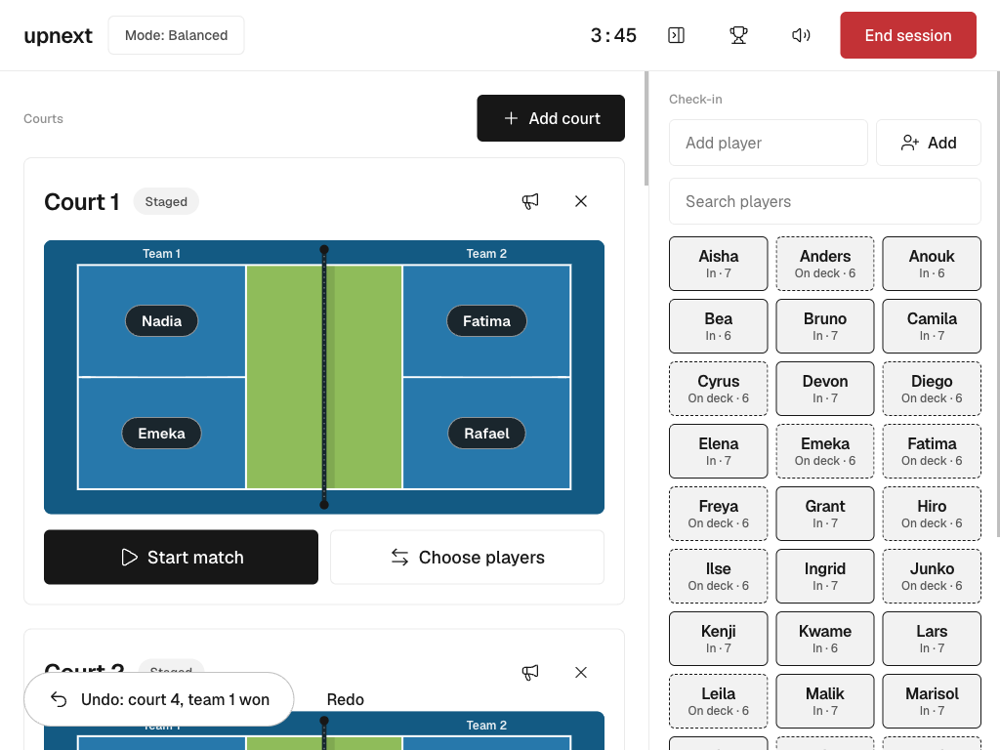

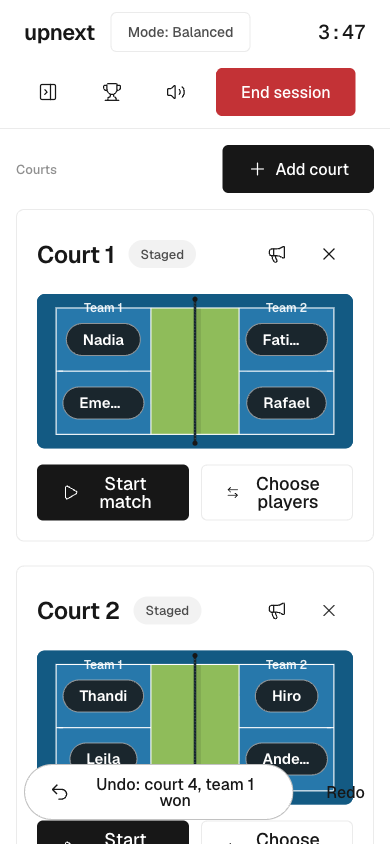

Both match the Chrome measurements at the same sizes, which is the only thing
this can tell you. **This is Blink with a different user agent string, not
WebKit.** It says nothing about iOS speech synthesis, the wake lock API, Add to
Home Screen, or how Safari's toolbar interacts with `100dvh`. Those need a real
iPhone and a real iPad, and CJ is doing that himself.

### 12.10 Where the ranked list stands now

| Item | Was | Now |
|---|---|---|
| 1. Voice runs 18.3 s behind | launch blocker | fixed, worst spoken lag 3.43 s |
| 2. Board is one column at 1024 and 1280 | launch blocker | fixed at 1280 open and 1024 hidden. 1024 with the rail open still needs an overlay rail |
| **New. Undo pill covers court 3's controls at 1280x900** | | **decide before launch**, see 12.5 |
| New. Four simultaneous finishes lose three results to the shelf life | | accepted trade, see 12.6 |
| 3. Queue panels as large as live courts | out of scope | still open, and cheaper now that they are 424px |
| 4. Fifty-four sub-48px controls | out of scope | still open |
| 5. No error boundary | out of scope, lives in `App.tsx` | still open |
| 6. Check-in is 78 interactions | out of scope | still open |
| 7 to 9. Replay, `addPlayer`, IndexedDB | do not bother yet | unchanged |

### 12.11 Branch state

`origin/main` moved from `a343627` to `ada0070` while this was being measured,
so every number in section 12 was taken on `a343627` plus the changes in 12.1.
This branch has since been rebased onto `ada0070` for the pull request.

The rebase hit one conflict, in `src/screens/SessionBoard.tsx`, where both sides
add a module constant right after `RAIL_MOTION`: my `BOARD_GRID` and their
`UNDO_WINDOW_MS`. Resolved by keeping both. `src/App.test.tsx` and
`src/routes/BoardRoute.tsx` merged on their own. On the rebased tree
`npm run typecheck` is clean and all 465 tests pass.

What that means for the numbers above:

- **The voice measurements still hold.** `ada0070` touches the win control, the
  undo pill and `finishGame`'s score argument. It does not touch
  `announce.ts`, `speech.ts` or the announcer, and it does not change what gets
  announced or when.
- **The grid column counts still hold.** They follow from content width, which
  `ada0070` does not change.
- **The screens-of-scroll numbers are now conservative.** `ada0070` removes the
  score row from a live court card, so cards are shorter than the ones measured
  here and every scroll figure should come out lower. I have not re-measured.
- **The interaction latency numbers were taken on the old control.** A win was
  two score fields and a verdict button; on `main` it is one tap on Team 1 wins
  or Team 2 wins. Fewer interactions for the same event, so nothing here gets
  worse, but the tap-to-paint figure has not been re-taken on the new button.
- **12.5 needs re-checking after merge.** `ada0070` hides the undo pill ten
  seconds after an action and its cards are shorter, so where the pill lands
  relative to court 3 has moved. The overlap may be smaller, or gone. The hit
  test in 12.5 is a two minute re-run.

Re-running the harness against the rebased build needs the driver updated
first: it types into score fields that no longer exist and finds a live court by
looking for them.
